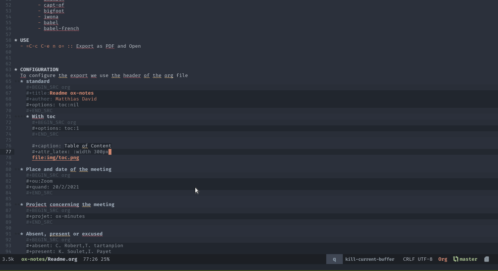
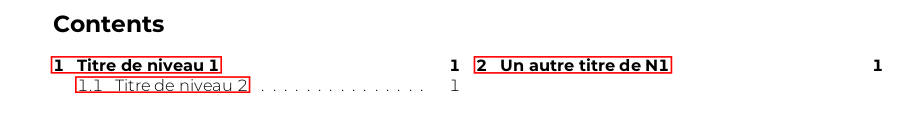
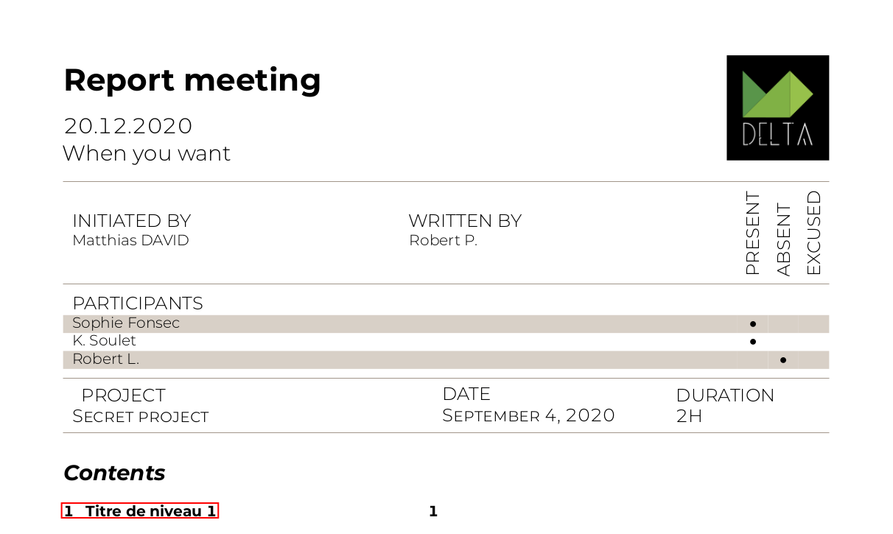

# OX-REPORT
> Export your org file to minutes report PDF file

## INSTALLATION

Local

    (use-package! ox-report
      :load-path "~/Dropbox/emacs/lib/ox-report")

Doom Emacs

    ;;ox-minutes
    (package! ox-report
      :recipe (:host github :repo "DarkBuffalo/ox-report"))

## Pre-requisite

### Linux

-   **Texlive:** `sudo apt install texlive texlive-extra texlive-fonts-extra`

1.  Latex package
    -   titling
    -   enumitem
    -   snotez
    -   pgfopts
    -   pgf
    -   marginnote
    -   xpatch
    -   classicthesis
    -   bera
    -   eulervm
    -   mparhack
    -   titlesec
    -   tocloft ??
    -   arsclassica
    -   tcolorbox
    -   environ
    -   trimspaces
    -   ncctools
    -   lastpage
    -   wrapfig
    -   amsmath
    -   capt-of
    -   bigfoot
    -   iwona
    -   babel
    -   babel-french

# USE

-   **`C-c C-e r o`:** Export as PDF and Open

## CONFIGURATION

To configure the export we use the header of the org file

### standard

    #+title:Readme ox-notes
    #+author: Matthias David
    #+options: toc:nil

#### With toc

    #+options: toc:1

### Place and date of the meeting

    #+ou:Zoom
    #+quand: 20/2/2021

### Project concerning the meeting

    #+projet: ox-report

### Absent, present or excused

    #+absent: C. Robert,T. tartanpion
    #+present: K. Soulet,I. Payet
    #+excuse:Sophie Fonsec,Karine Soulet

## SCREENSHOT

## Todos
- [ ] Add: logo
- [ ] Add: English
- [ ] Fix: Timebox
- [ ] Fix: Multitoc error
- [X] Ajouter le choix de la Toc par options dans ox-notes
- [X] Ajouter le tableau de présence en intro
- [X] Ajouter la function fullwidth

## Release History
* 0.1
  * ADD: Layout like Tufte
  * ADD: two columns toc
  * ADD: margin notes replace footnote
  * ADD: table as possible on notes
  * ADD: timebox
  * ADD: fullpage margin

## Contributing

1. Fork it (<https://github.com/DarkBuffalo/ox-report/fork>)
2. Create your feature branch (`git checkout -b feature/fooBar`)
3. Commit your changes (`git commit -am 'Add some fooBar'`)
4. Push to the branch (`git push origin feature/fooBar`)
5. Create a new Pull Request
